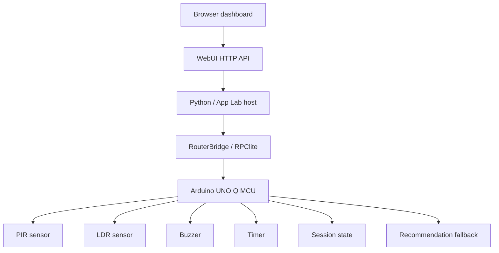

# Smart Study AI Platform Architecture

## Current production architecture

This project is a working Arduino UNO Q + Arduino App Lab deployment. The active architecture is not the historical OLED prototype; the production path is:

## Telemetry flow

1. The MCU reads PIR motion and LDR light state.
2. The session and timer logic update focus, idle, and break state.
3. The MCU recommendation logic computes the baseline recommendation string.
4. The Python host requests telemetry over Bridge RPC.
5. The host adds AI refinement if available and safe to run.
6. The result is returned to the browser as a versioned telemetry envelope.

## Command flow

1. The browser triggers a fetch to `/api/command/{command}`.
2. `python/main.py` routes the request to the host-side command handler.
3. The host validates the command against a whitelist.
4. The command is forwarded over RouterBridge / RPClite.
5. The MCU executes the matching RPC callback registered in `sketch/communication.cpp`.
6. A success or error envelope is returned to the UI.

## AI flow

1. The MCU produces the deterministic recommendation result.
2. The Python host builds an AI context summary from telemetry.
3. The AI provider builds a prompt and issues a background inference request.
4. The result is cached and throttled using context gating.
5. The dashboard recommendation is AI-enhanced when available; otherwise it remains rule-based and stable.

## Fallback flow

- AI failure does not break telemetry.
- AI failure does not break sensors or control actions.
- AI failure falls back to the MCU baseline recommendation.
- Bridge failure triggers stale-telemetry fallback when available.

## Error flow

- Invalid commands return an `error` envelope.
- Bridge communication problems return a structured `error` payload with a code and message.
- AI failures are marked through `aiStatus` without taking the whole system offline.
- Stale telemetry is flagged in the UI instead of blanking the dashboard.

## Design notes

- The MCU remains the authoritative source for sensor and session state.
- The Python host is responsible for aggregation, AI layering, and App Lab/WebUI integration.
- The WebUI is a thin dashboard and command surface over a trusted local communication path.
- The current design assumes a trusted local or local-network deployment environment.
- The protected `include/config.h` file remains untouched and is treated as a fixed embedded configuration contract.
