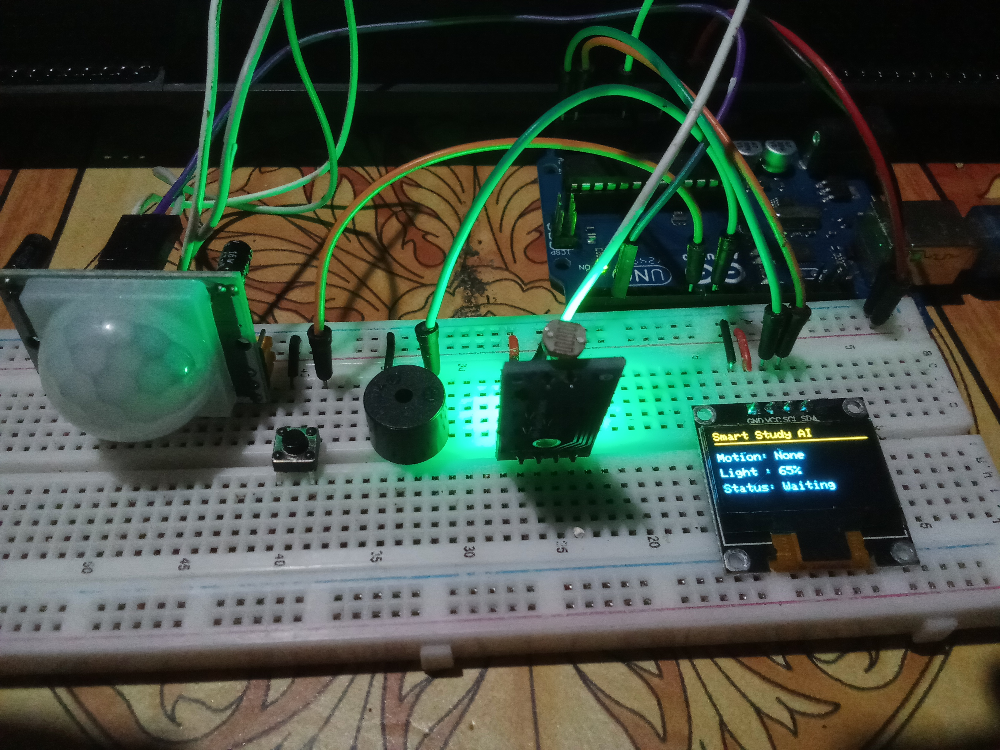
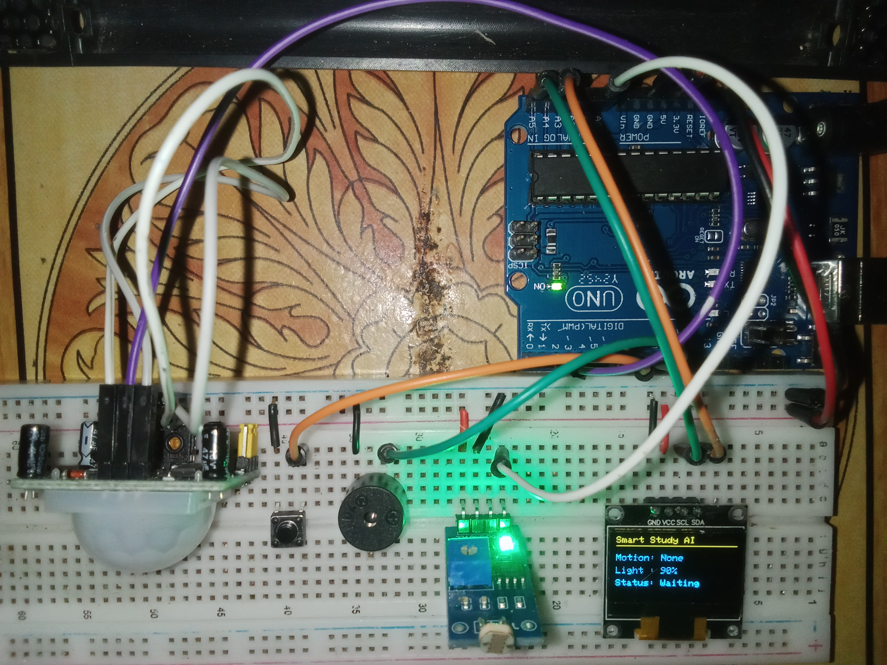

<h1 align="center">SMART STUDY SPACE MONITOR</h1>
<p align="center">Copyright: Jhon Paul Baonil 2026</p>
<br>
<p align="center">This is the main project repository of my project for Hackster Invent the Future Global Hackathon.</p>

**Sample Images**<br>




**Sample Video**
<video width="640" height="360" align="center" controls>
  <source src="./docs/screenshots/vid1.mp4" type="video/mp4">
  Your browser does not support the video tag.
</video>

## Important Details
Displays Address: 0x3C

### Wiring:

#### PIR Sensor Wiring
```
PIR

VCC → 5V

GND → GND

OUT → D2
```

#### LDR Module Wiring
```
If your LDR module has pins:

AO
DO
GND
VCC

Connect:

VCC → 5V

GND → GND

AO → A0

Ignore DO for now.

We'll use the analog value.
```

#### Buzzer Wiring
```
GND → GND
VCC → D8
```

#### Main Project Wiring
```
UNO

5V
├── OLED VCC
├── PIR VCC
├── LDR VCC
└── BUZZER VCC

GND
├── OLED GND
├── PIR GND
|── LDR GND
└── BUZZER GND


D2 → PIR OUT

A0 → LDR AO
```

## Arduino Pin Assignments
```
| Component                  | Arduino Pin |
| -------------------------- | ----------- |
| PIR Sensor                 | D2          |
| Active Buzzer              | D8          |
| LDR Sensor (analog output) | A0          |
```

## Folder Structure

```
Smart Study Space Monitor
│
├── docs/
│   ├── 01_ARCHITECTURE_ANALYSIS.md
│   ├── 02_REFACTOR_PLAN.md
│   ├── 03_IMPLEMENTATION.md
│   ├── 04_TEST_REPORT.md
│   ├── PHASE6_6_IMPLEMENTATION.md
│   ├── PHASE6_7_FOCUS_SESSION_LOGIC.md
│   ├── PHASE6_OLED_ROOT_CAUSE_ANALYSIS.md
│   ├── architecture.md
│   ├── milestones.md
│   ├── roadmap.md
│   ├── screenshots/
│   └── public/
│
├── include/
│   └── config.h
│
├── lib/
│
├── src/
│   ├── main.cpp
│   ├── button.cpp
│   ├── button.h
│   ├── buzzer.cpp
│   ├── buzzer.h
│   ├── ldr.cpp
│   ├── ldr.h
│   ├── pir.cpp
│   ├── pir.h
│   ├── recommendation.cpp
│   ├── recommendation.h
│   ├── session.cpp
│   ├── session.h
│   ├── timer.cpp
│   ├── timer.h
│   ├── ui.cpp
│   └── ui.h
│
├── test/
│
├── platformio.ini
├── readme.md
├── CHANGELOG.md
├── LICENSE-APACHE
├── LICENSE-MIT
└── .gitignore
```

## Plan to implement this project

```
Stage 1
OLED only ✅
(Currently working)

↓

Stage 2
OLED + PIR

↓

Stage 3
OLED + LDR

↓

Stage 4
OLED + Push Button

↓

Stage 5
OLED + Buzzer

↓

Stage 6
Combine everything

↓

Stage 7
Study Session Logic

↓

Stage 8
Arduino Cloud / AppLab

↓

Stage 9
AI Recommendation System

↓

Stage 10
Final Housing + Presentation
```

## LICENSE 
[Apache License](LICENSE-APACHE)<br>
[MIT License](LICENSE-MIT)

## Issues 

Adafruit 1306 Library Compilation Error 

https://github.com/adafruit/Adafruit_SSD1306/issues/301