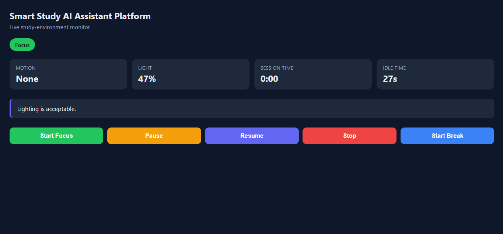
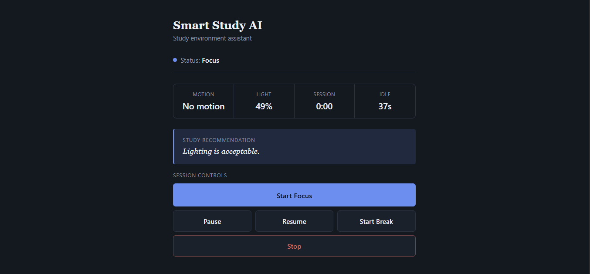

<h1 align="center">SMART STUDY SPACE MONITOR</h1>
<p align="center">Copyright: Jhon Paul Baonil 2026</p>
<br>
<p align="center">This is the main project repository of my project for Hackster Invent the Future Global Hackathon.</p>

**Sample Images of V1.0.0**<br>
<p align="center">


</p>

**Sample Image of V2.0.0**<br>
<p align="center">

</p>

**Sample Image of V3.0.0**<br>
<p align="center">

</p>

**Sample Video**<br>
<video width="640" height="360" align="center" controls>
  <source src="./docs/screenshots/vid1.mp4" type="video/mp4">
</video>

## Project Overview
Smart Study AI Platform is an Arduino Uno Q project that combines environmental sensing, session management, and a browser-based WebUI. The current release focuses on a live dashboard that displays motion, ambient light, session timing, and recommendation feedback through Arduino App Lab.

### Current Release Focus
- Arduino Uno Q WebUI dashboard
- Live telemetry from motion and light sensors
- Session control from the web interface
- Recommendation display and state feedback
- Bridge RPC communication between the MCU and the App Lab host

### Wiring:

#### PIR Sensor Wiring
```
PIR

VCC → 5V

GND → GND

OUT → D2
```

#### LDR Module Wiring
```
If your LDR module has pins:

AO
DO
GND
VCC

Connect:

VCC → 5V

GND → GND

AO → A0

Ignore DO for now.

We'll use the analog value.
```

#### Buzzer Wiring
```
GND → GND
VCC → D8
```

#### Main Project Wiring
```
UNO

5V
├── OLED VCC
├── PIR VCC
├── LDR VCC
└── BUZZER VCC

GND
├── OLED GND
├── PIR GND
|── LDR GND
└── BUZZER GND


D2 → PIR OUT

A0 → LDR AO
```

## Arduino Pin Assignments
```
| Component                  | Arduino Pin |
| -------------------------- | ----------- |
| PIR Sensor                 | D2          |
| Active Buzzer              | D8          |
| LDR Sensor (analog output) | A0          |
```

## Folder Structure

```
Smart Study Space Monitor
│
├── app.yaml
├── assets/
│   └── index.html
├── docs/
│   ├── ARCHITECTURE.md
│   ├── AI_ARCHITECTURE.md
│   ├── COMMUNICATION_PROTOCOL.md
│   ├── PHASE8_PRODUCTION_AUDIT.md
│   ├── PHASE8_RELEASE_READINESS.md
│   ├── RELEASE_CHECKLIST.md
│   └── screenshots/
├── python/
│   ├── ai_recommendation.py
│   ├── device.py
│   ├── main.py
│   └── protocol.py
├── sketch/
│   ├── buzzer.cpp
│   ├── buzzer.h
│   ├── communication.cpp
│   ├── communication.h
│   ├── config.h
│   ├── ldr.cpp
│   ├── ldr.h
│   ├── main.cpp
│   ├── pir.cpp
│   ├── pir.h
│   ├── recommendation.cpp
│   ├── recommendation.h
│   ├── session.cpp
│   ├── session.h
│   ├── sketch.ino
│   ├── sketch.yaml
│   ├── timer.cpp
│   └── timer.h
├── test/
│   └── test_ai_hardening.py
├── include/
│   └── config.h
├── readme.md
├── CHANGELOG.md
├── LICENSE-APACHE
├── LICENSE-MIT
└── .gitignore
```

## Release Status

### v1.0.0-rc1 — Release Candidate

This is the **Release Candidate** for the Smart Study AI Platform. The project features an Arduino UNO Q platform with WebUI dashboard and AI-assisted study recommendations.

**Release Status:** ✅ Ready for Release Candidate

**Key Features:**
- Arduino UNO Q WebUI dashboard with live telemetry
- Motion and light sensor monitoring
- AI-enhanced study recommendations with deterministic fallback
- Session management (focus/break/idle with smart timeout)
- Non-blocking buzzer feedback and idle warnings
- Trusted-network deployment model

**Documentation:**
- **[RELEASE.md](docs/RELEASE.md)** — Comprehensive release notes, architecture, and features
- **[QUICKSTART.md](docs/QUICKSTART.md)** — Developer guide for building and running the system
- **[ARCHITECTURE.md](docs/ARCHITECTURE.md)** — Current production architecture
- **[AI_ARCHITECTURE.md](docs/AI_ARCHITECTURE.md)** — AI layer design and fallback behavior
- **[COMMUNICATION_PROTOCOL.md](docs/COMMUNICATION_PROTOCOL.md)** — RPC and API protocol specification

**Legacy Notes:**
- Earlier versions (v1.0.0, v2.0.0) used an SSD1306 OLED display and local button-based interaction
- Historical documentation remains in the repository for development context
- Current release focuses exclusively on UNO Q WebUI experience

## Project Structure
The project now includes both embedded firmware and App Lab/WebUI components:
- `sketch/` for the Arduino Uno Q firmware
- `python/` for the host-side App Lab integration
- `assets/` for the browser dashboard
- `docs/` for architecture and implementation notes

## LICENSE 
[Apache License](LICENSE-APACHE)<br>
[MIT License](LICENSE-MIT)

## Getting Started

**New to this project?** Start with the [QUICKSTART.md](docs/QUICKSTART.md) guide for step-by-step setup and operation instructions.

**Want release details?** See [RELEASE.md](docs/RELEASE.md) for comprehensive release notes, architecture, and known limitations.
